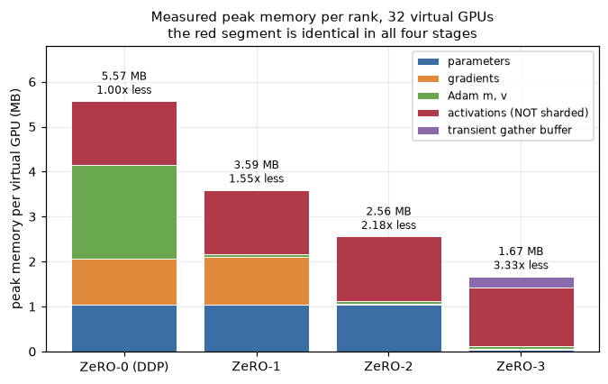
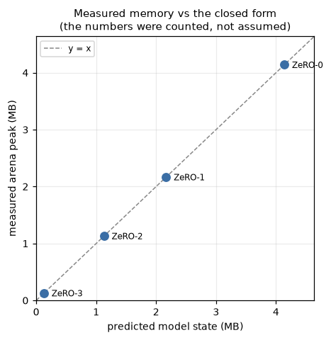
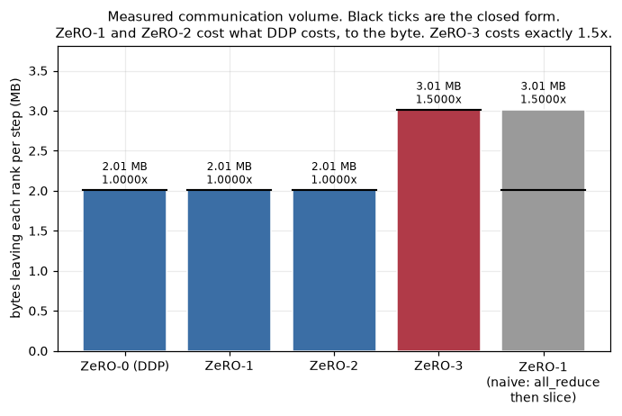
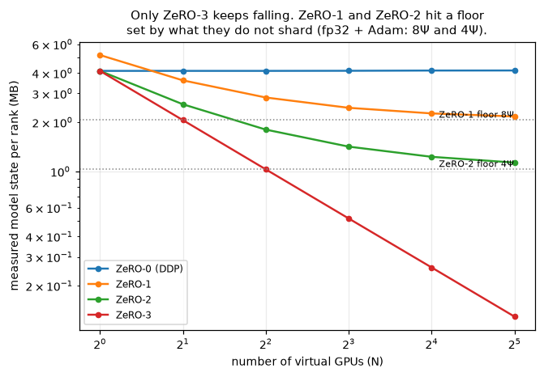
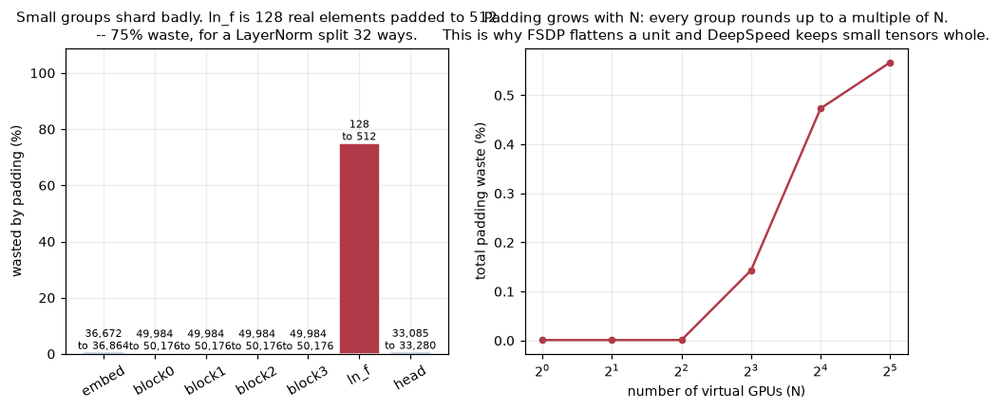
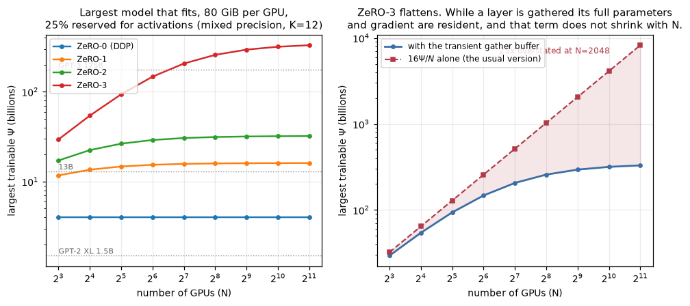
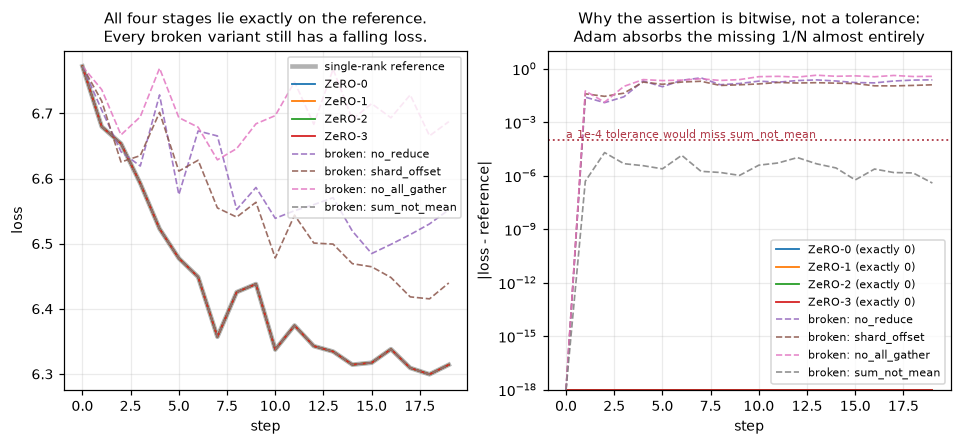

# ZeRO-1, ZeRO-2 and ZeRO-3 on 32 virtual GPUs

32 fake GPUs made from CPU threads. A small transformer trains on them 4 ways: normal data
parallel, then ZeRO stages 1, 2 and 3. Every memory and network number is **measured**, not
estimated.

**Notebook:** [`zero_32_virtual_gpus.ipynb`](zero_32_virtual_gpus.ipynb) ·
**Numbers:** [`results/metrics.csv`](results/metrics.csv) ·
**Repo:** https://github.com/KarthikeyanMohanraj17/ERA_LLM_training

---

## 1. The problem

Train on 4 GPUs. Each gets different data, computes gradients, they average, everyone updates.

The catch: **every GPU stores the whole model state.**

GPT-2 XL, 1.5B params, mixed precision + Adam:

| what | size |
|---|---|
| fp16 weights | 3 GB |
| fp16 gradients | 3 GB |
| fp32 master weights | 6 GB |
| Adam `m` | 6 GB |
| Adam `v` | 6 GB |
| **total** | **24 GB** |

- That's **16 bytes per parameter**.
- Doesn't fit on a 16 GB card. Doesn't fit before activations even exist.
- **18 of those 24 GB are identical on every GPU.** Add a 33rd GPU → still 18 GB each.
- So data parallelism buys speed and **zero** memory.

---

## 2. What ZeRO does

Stop copying the same thing 32 times. Split it. Rebuild only when needed.

| Stage | Splits | Per-GPU (N=32) | Network cost |
|---|---|---|---|
| ZeRO-0 (DDP) | nothing | 16Ψ | 1× |
| **ZeRO-1** | optimizer (`m`, `v`) | 8.25Ψ | **1×** |
| **ZeRO-2** | + gradients | 4.4Ψ | **1×** |
| **ZeRO-3** | + weights | 0.5Ψ | **1.5×** |

- ZeRO-3: each GPU keeps **1/32 of every weight**.
- Needs a layer → asks the other 31 for their pieces → uses it → throws it away.

---

## 3. Why ZeRO-1 and ZeRO-2 are FREE

Most people get this wrong, including me at first.

**Wrong thinking:** DDP = 1 message, ZeRO-1 = 2 messages, so ZeRO-1 costs more.

**Why it's wrong:** DDP's "one message" is already two.

An all-reduce is literally:

```
step 1  reduce-scatter  -> each GPU ends up owning the sum of one slice
step 2  all-gather      -> pass slices around until everyone has all of them
```

- ZeRO-1 does **the same two steps**.
- Only difference: step 2 carries *updated weights* instead of *summed gradients*.
- Same number of elements. Same bytes.
- ZeRO-2 changes **no** message at all — it just frees gradients earlier.

**Measured:** `2,103,040` bytes per GPU per step for ZeRO-0, ZeRO-1 **and** ZeRO-2. The same
integer, not "about the same".

> **Takeaway:** if ZeRO-2 costs what DDP costs and uses 3.66× less memory, there's no good
> reason to run plain DDP.

---

## 4. Why ZeRO-3 costs 1.5×

- ZeRO-3 throws weights away after the forward pass.
- Backward needs them again → **fetch twice**.
- 3 steps instead of 2 → **exactly 1.5×**. Measured `3,154,560` bytes = `1.5000×`.
- True for every N, not just 32.

**Worth it?** Usually yes: 50% more network for 8.75× less memory than ZeRO-2.

**And 1.5× is a setting, not a law.** Keep the weights around between forward and backward and
it drops back to 1×. That's `reshard_after_forward` in PyTorch FSDP.

---

## 5. Results

Model: Ψ = `269,821` params (padded to `271,360`, so `8,480` per GPU), 32 virtual GPUs.

### Memory and network

| Mode | Model state / GPU | vs DDP | Network / GPU / step | vs DDP |
|---|---|---|---|---|
| ZeRO-0 | `4,341,760` B | 1.00× | `2,103,040` B | 1.0000× |
| ZeRO-1 | `2,272,640` B | 1.91× | `2,103,040` B | 1.0000× |
| ZeRO-2 | `1,187,200` B | 3.66× | `2,103,040` B | 1.0000× |
| ZeRO-3 | `135,680` B | **32.00×** | `3,154,560` B | **1.5000×** |



### The catch: activations don't shard

- ZeRO splits **weights, gradients, optimizer**. That's it.
- Activations (values saved during forward) are untouched: `1,495,428` bytes, **identical in
  all 4 modes and on all 32 GPUs**.
- So model state dropped **32.00×**, but real peak memory only dropped **3.33×**.
- Fix is activation checkpointing — a different tool, not ZeRO.

### More figures





- ZeRO-1 and ZeRO-2 **flatten out**. They have a floor (8Ψ and 4Ψ) because of what they don't
  split. More GPUs won't help.
- Only ZeRO-3 keeps falling. That's the real argument for stage 3.




### Biggest model that fits

80 GiB per GPU, 25% held back for activations, mixed precision:

| N | ZeRO-0 | ZeRO-1 | ZeRO-2 | ZeRO-3 |
|---|---|---|---|---|
| 8 | 4.0B | 11.7B | 17.2B | 29.5B |
| 32 | 4.0B | 14.7B | 26.4B | 93.7B |
| 64 | 4.0B | 15.4B | 29.0B | 147.3B |
| 512 | 4.0B | 16.0B | 31.8B | 294.5B |

---

## 6. Is it actually correct?

**All 4 modes give bit-for-bit identical answers.** Not "close". `max|delta| = 0.000e+00` across
54 tensors, and identical to a single-GPU reference too.

Why that's possible:
- `all_reduce` is **built as** reduce-scatter + all-gather, so ZeRO-0 adds the same numbers in
  the same order as ZeRO-1/2/3.
- Adam works element-by-element, so running it on a slice = running it on the whole thing and
  looking at that slice.

**All 32 validation checks pass.**

### I broke it on purpose, 4 ways



| Bug | Loss error | Loss still fell? | Caught by |
|---|---|---|---|
| correct code | **0.000e+00** | — | — |
| `no_reduce` — never sync gradients | 1.610e-01 | ✅ yes | normal tolerance |
| `shard_offset` — update slice off by 1 | 1.377e-01 | ✅ yes | normal tolerance |
| `no_all_gather` — never rebuild weights | 2.045e-01 | ✅ yes | normal tolerance |
| `sum_not_mean` — forget to divide by 32 | **5.007e-06** | ✅ yes | **only bit-exact check** |

> **Every broken version still trained.** "The loss went down" proves nothing.

**Why `sum_not_mean` is nearly invisible:** Adam divides by the gradient's own size. Make all
gradients 32× bigger and it mostly cancels. Under plain SGD this would be a 32× learning rate
and instant blow-up.

---

## 7. Things I got wrong

**1. My memory counter double-counted.**
A `.view()` shares memory, it isn't new memory. Counting `numel × itemsize` per tensor inflated
everything. Fix: key on the storage address.

**2. Then the fix had a worse bug.**
Free some memory → the OS reuses the address → my counter says "already counted" → undercounts
forever. Fix: hold a reference to the storage. Test that caught it is 4 lines with a
`gc.collect()` in the middle.

**3. Autograd won't let you free a gathered weight.**
ZeRO-3's whole point is freeing weights after use. But PyTorch saves the weight for backward, so
dropping your reference frees nothing. Real FSDP's trick: **resize the storage to 0 bytes**, then
resize back and refill before backward. Saved views follow the storage.

**4. That then broke autograd's version check.**
Writing into storage whose views were saved raises *"variable needed for gradient computation was
modified in-place"*. Fix is `torch.autograd._unsafe_preserve_version_counter` — not a hack I
invented, FSDP2 uses it at the same spot.

**5. Tiny layers shard terribly.**
Final LayerNorm = 128 numbers. Split 32 ways with padding → `512`. **75% waste.** Whole model
is only 0.57% wasted because blocks dominate, but the ratio gets worse as N grows. Real
libraries have a setting for this (`stage3_param_persistence_threshold`).

**6. ZeRO-3's temporary buffer nearly made my scaling table a lie.**
While a layer is gathered, its full weights *and* gradient are live — and that **doesn't shrink
with N**. Size is set by the biggest group (`50,176` elements here), not by Ψ/32. Ignore it and
the table claims 8 trillion params at N=2048. With it: 330 billion. **25× overstated.**

**7. Measuring cost more than the work.**
The activation tracker fired a Python callback per saved tensor. `weakref.finalize` is ~0.3 ms
a call. Swapping to `__del__` and tracking one rank took a step from 1595 ms → 524 ms.

---

## 8. What this does NOT prove

- **Threads aren't GPUs.** Memory here is a software ledger, not a device measurement.
- **There's no network.** A "collective" is a memcpy. Byte counts are real; times are not.
- **No speed claim anywhere.** 32 threads under Python's GIL measure Python, not ZeRO. There is
  deliberately **no timing chart** in this repo.
- **fp32, not mixed precision.** So my ratios are the *weaker* ones. The paper's famous numbers
  are reproduced by formula, not measured.
- **Ψ = 269,821, not 269 billion.** 5 orders of magnitude below anything real.
- **Only N=32 measured end to end** (except the sweep figure).

**What it does prove:**
- The formulas are right — they reproduce the ZeRO paper's Table 1 exactly (120 / 31.4 / 16.6 /
  1.88 GB at Ψ=7.5B, and 2048 / 536 / 284 / 32 GB at 128B).
- All 4 stages are bit-for-bit identical to a single-GPU reference.
- Network volumes match the maths to the byte.
- The tests can actually fail — 4 planted bugs prove it.

---

## 9. Checked against real PyTorch

`torchrun --nproc_per_node=4` on gloo, **same model code on both sides**.

| | world = 1 | world = 4 |
|---|---|---|
| my ZeRO-0 vs real DDP | 4.768e-07 ✅ | 8.345e-07 ✅ |
| my ZeRO-3 vs real FSDP2 | ✅ | ❌ |
| **real DDP vs real FSDP2** | ✅ bitwise | **❌ same gap** |

- **My DDP matches PyTorch's DDP.** That one check validates the threads, the collectives, the
  model and the data pipeline all at once.
- FSDP2 **does** run on CPU/gloo (the "FSDP needs NCCL" advice is outdated).
- At 4 GPUs it disagrees — but **PyTorch's own DDP and FSDP2 disagree by the same amount**, so
  it's not my bug.
- **Cause:** FSDP2 hooks its gradient-sync onto the model's *input*. My model's input is integer
  token IDs, which have no gradient, so the hook never fires.
- I left it broken and documented rather than writing a second model to make it green — a second
  model means a mismatch could be the model instead of the parallelism.

**Honest claim:** ZeRO-0 is verified against PyTorch DDP. ZeRO-1/2/3 are verified against a
single-GPU reference and against each other, **not** against FSDP.

> Note: this only checks *numbers*, not *bytes*. gloo has no real reduce-scatter — it does a
> full all-reduce then copies out a chunk. So gloo byte counts would contradict correct maths.

---

## 10. Run it

**Colab** — click, then Runtime → Run all. ~2 min, CPU runtime is fine:

https://colab.research.google.com/github/KarthikeyanMohanraj17/ERA_LLM_training/blob/session-12-distributed-training/session-12-distributed-training/zero_32_virtual_gpus.ipynb

**Local** (Python 3.12 — torch has no 3.14 wheels):

```bash
git clone https://github.com/KarthikeyanMohanraj17/ERA_LLM_training.git
cd ERA_LLM_training/session-12-distributed-training
python3.12 -m venv .venv && .venv/bin/pip install -r requirements.txt

.venv/bin/python -m pytest tests/ -q                 # 15 unit tests
.venv/bin/python scripts/make_results.py --steps 20  # figures + results
OMP_NUM_THREADS=1 .venv/bin/torchrun --nproc_per_node=4 scripts/torch_crosscheck.py
```

The notebook already has its outputs saved, so you can just read it.

---

## 11. Files

```
zero_32_virtual_gpus.ipynb   the notebook, outputs included

vzero/
  vgpu.py         counts bytes. Keyed by storage address so views are free.
                  Every memory number depends on this being right.
  fabric.py       the collectives. all_reduce is BUILT from reduce_scatter +
                  all_gather -- that's what makes the bit-exact claims work.
                  Two versions, proven identical: a real 31-step ring, and a
                  fast path for the runs.
  shard.py        how Psi params become 32 slices. Padding made visible.
  model.py        a transformer with no nn.Module -- with one, weights always
                  exist and ZeRO-3 can't be shown honestly.
  optim.py        Adam on a slice. Element-wise, which is half the bit-exact proof.
  engine.py       the 4 modes + the single-GPU reference.
  accounting.py   activation memory, measured not guessed.
  analysis.py     formulas only, no measurement, so the notebook can compare.
  validate.py     32 assertions + the 4 planted bugs.
  report.py       figures. Deliberately contains no timing plot.
  pool.py         worker threads. One rank crashing kills all 32 fast instead
                  of 32 separate timeouts.

scripts/
  make_results.py      regenerates figures/ and results/
  torch_crosscheck.py  real DDP + FSDP2 under torchrun
  build_notebook.py    generates the .ipynb, so code is never copy-pasted
  check_readme.py      checks every number in this file against results/

tests/     15 tests, incl. "a mismatched rank must crash, not hang"
figures/   committed, so GitHub shows them without running anything
results/   metrics.csv, summary.json, crosscheck-world{1,4}.json
```

---

## Sources

All paper numbers were read from the papers, not recalled.

| Paper | Link | Used for |
|---|---|---|
| ZeRO | [1910.02054](https://arxiv.org/abs/1910.02054) | the 3 stages, Table 1, the 1× / 1.5× claims |
| PyTorch FSDP | [2304.11277](https://arxiv.org/abs/2304.11277) | `reshard_after_forward` |
| ZeRO-Offload | [2101.06840](https://arxiv.org/abs/2101.06840) | mentioned only |
| ZeRO-Infinity | [2104.07857](https://arxiv.org/abs/2104.07857) | mentioned only |
| ZeRO++ | [2306.10209](https://arxiv.org/abs/2306.10209) | mentioned only |
| Activation checkpointing | [1604.06174](https://arxiv.org/abs/1604.06174) | the activations problem |
| Megatron-LM | [1909.08053](https://arxiv.org/abs/1909.08053) | tensor parallelism contrast |
| PyTorch DDP | [2006.15704](https://arxiv.org/abs/2006.15704) | gradient bucketing |
| Adam | [1412.6980](https://arxiv.org/abs/1412.6980) | the optimizer, and its scale invariance |

Ring all-reduce: Patarasuk & Yuan, JPDC 69(2), 2009 (no arXiv).

PyTorch internals were read from installed source at torch 2.14.0 — `ProcessGroupGloo.cpp` for
gloo's reduce-scatter, `_fsdp_init.py` / `_fsdp_collectives.py` for FSDP2's CPU paths.
